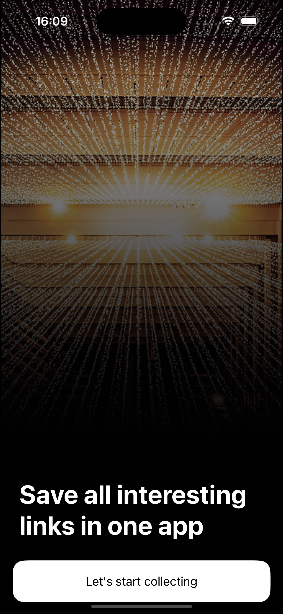
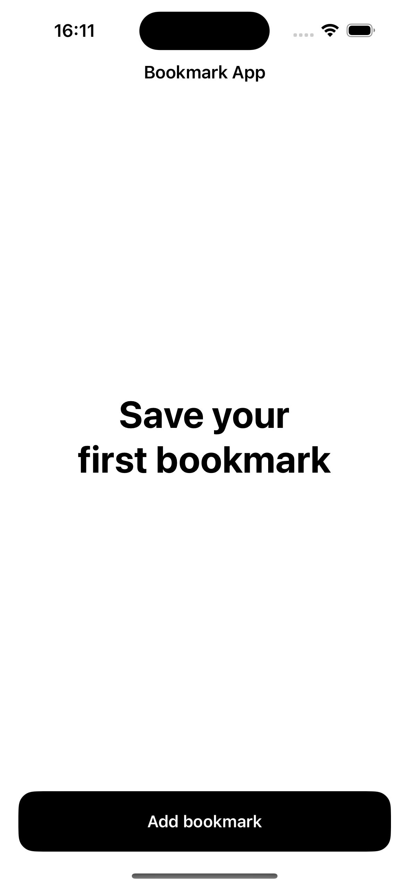
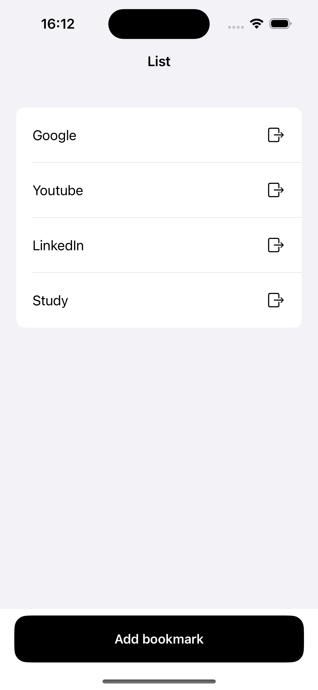

# BookmarkApp

A simple and efficient Bookmark Manager that allows users to **store, view, and delete bookmarks**.

## ✨ Features
✅ Save website links with titles  
✅ View and access saved bookmarks  
✅ Swipe-to-delete functionality  
✅ Persistent storage 

### 🛠 Onboarding View
The onboarding screen helps users get started by explaining the app's features.

### 📌 Main View
The main screen allows users to add, view, and manage bookmarks.

### ✅ Main View with Saved Bookmarks
Once bookmarks are saved, users can see a list and access them easily.

